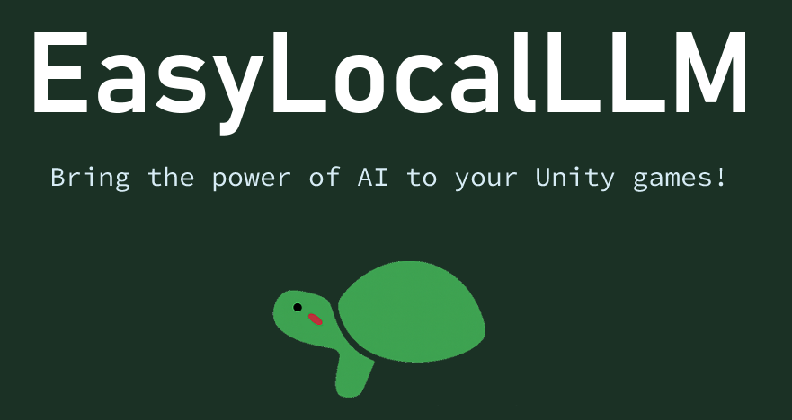
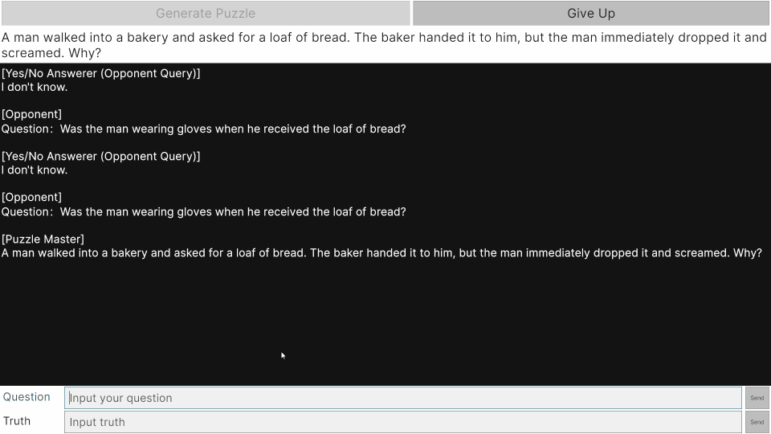
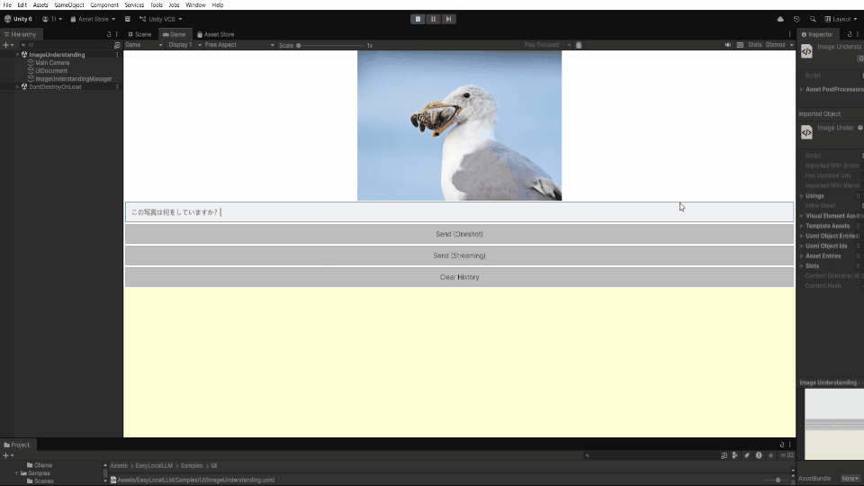

# [EasyLocalLLM](https://github.com/kamekichi128/EasyLocalLLM)

EasyLocalLLM is a Unity library that makes it easy to use a local LLM (Ollama / wllama). With just a few lines of code, you can build offline AI chatbots and natural in-game NPC conversations.

## ✨ Main Features

- 🚀 **Easy setup**: Start with minimal code (as little as 3 lines)
- 💬 **Streaming support**: Receive responses incrementally in real time
- 🔧 **Flexible configuration**: Fine-grained customization via `OllamaConfig` or `WllamaConfig`
- 🔄 **Automatic retry**: Exponential backoff for network errors
- 📝 **Session management**: Handle multiple conversations simultaneously
- 🎭 **System prompts**: Set different roles/characters per session
- 🛠️ **Tools support**: Call game features from the LLM via Function Calling
- 🔐 **Security**: Encrypted chat history with persistence support

## 🎯 Quick Start

Get running in just a few lines:

```csharp
using EasyLocalLLM.LLM;
using UnityEngine;

public class QuickStart : MonoBehaviour
{
    void Start()
    {
        var client = LLMClientFactory.CreateOllamaClient();
        StartCoroutine(client.SendMessageAsync(
            "Hello!",
            response => Debug.Log($"AI: {response.Content}")
        ));
    }
}
```

**Prerequisites**: Ollama server is running at `localhost:11434`, and the `mistral` model is installed.

For setting up Ollama itself, or building a game that includes Ollama server management, see [Inference Server Setup](Documentation/API_Reference.md#47-inference-server-setup).

## 🎬 Demo

### LLM with Multi Session Control




### VLM (qwen3-VL) and Streaming Response



## 💻 Requirements

- **Unity version**: Unity 2021.3 or later recommended
- **Supported OS**: Windows 10/11 or WebGL
- **Dependencies**: Ollama server for Windows, [Newtonsoft.Json](https://www.newtonsoft.com/json)
- **GPU**: Recommended (CPU works, but responses are slower)

## 📖 Documentation

For detailed usage, API reference, sample code, and troubleshooting:

- **[Documentation/API_Reference.md](Documentation/API_Reference.md)** - Technical documentation
- **[Samples/QuickStart.md](Samples/QuickStart.md)** - Beginner-friendly guide

### Key Topics

- [Basic Initialization](Documentation/API_Reference.md#41-basic-initialization)
- [Streaming Message (Receive Partial Responses)](Documentation/API_Reference.md#44-streaming-message-receive-partial-responses)
- [Inference Server Setup](Documentation/API_Reference.md#47-inference-server-setup)
- [Session Management](Documentation/API_Reference.md#48-session-management)
- [System Prompts](Documentation/API_Reference.md#49-system-prompts)
- [Tools (Function Calling)](Documentation/API_Reference.md#414-tools-function-calling)
- [Retry and Error Handling](Documentation/API_Reference.md#412-retry-and-error-handling)

## 📦 Samples

The `Samples/` folder includes the following sample scenes:

- **SimpleChat** - Basic chat UI implementation
- **LateralThinkingQuiz** - Lateral-thinking quiz game implementation
- **QuickStart** - Minimal functionality check. There are no scene file. To construct, see [QuickStart.md](Samples/QuickStart.md).
- **ImageUnderstanding** - Simple sample of VLM

## 🔧 Limitations

- Unity-only (depends on UnityWebRequest)
- Windows or WebGL support
- Task-based APIs are internally coroutine-based

## 📄 License

This library is provided under the MIT License.

```
MIT License

Copyright (c) 2026 EasyLocalLLM

Permission is hereby granted, free of charge, to any person obtaining a copy
of this software and associated documentation files (the "Software"), to deal
in the Software without restriction, including without limitation the rights
to use, copy, modify, merge, publish, distribute, sublicense, and/or sell
copies of the Software, and to permit persons to whom the Software is
furnished to do so, subject to the following conditions:

The above copyright notice and this permission notice shall be included in all
copies or substantial portions of the Software.

THE SOFTWARE IS PROVIDED "AS IS", WITHOUT WARRANTY OF ANY KIND, EXPRESS OR
IMPLIED, INCLUDING BUT NOT LIMITED TO THE WARRANTIES OF MERCHANTABILITY,
FITNESS FOR A PARTICULAR PURPOSE AND NONINFRINGEMENT. IN NO EVENT SHALL THE
AUTHORS OR COPYRIGHT HOLDERS BE LIABLE FOR ANY CLAIM, DAMAGES OR OTHER
LIABILITY, WHETHER IN AN ACTION OF CONTRACT, TORT OR OTHERWISE, ARISING FROM,
OUT OF OR IN CONNECTION WITH THE SOFTWARE OR THE USE OR OTHER DEALINGS IN THE
SOFTWARE.
```

## 🤝 Support

- **Bug reports & requests**: Please use Github Issues for bug reports and feature requests. Responses and fixes are not guaranteed.
- **Documentation**: See [Documentation/API_Reference.md](Documentation/API_Reference.md) for details
- **Sample code**: See the `Samples/` folder

---

**Bring the power of AI to your Unity games with EasyLocalLLM!** 🎮✨
